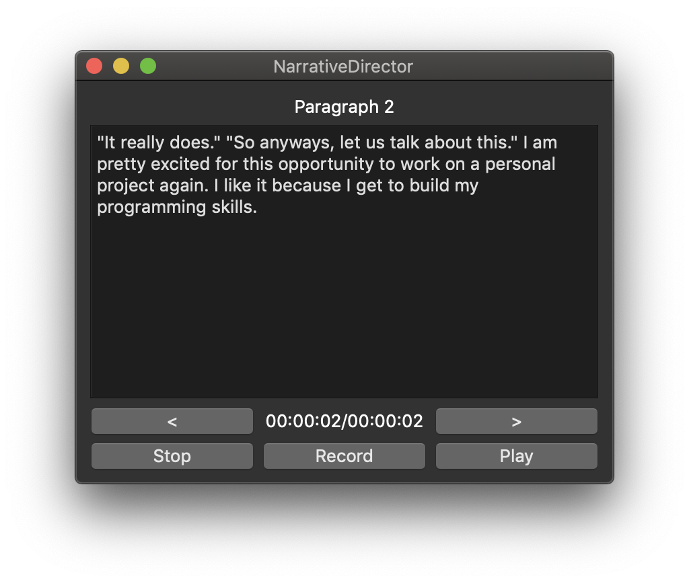
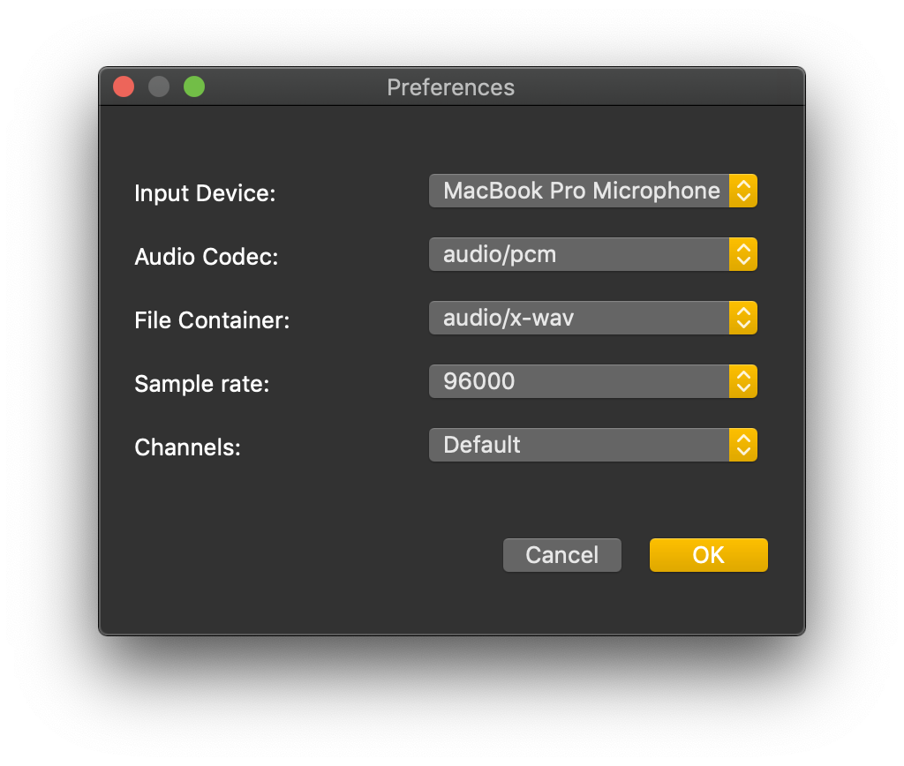

# Narrative Director

## Important Note
This project has been abandoned in favor of the rewrite, [narrative-director-rs](https://github.com/divark/narrative-director-rs).

---

Ever tried recording audio? Getting frustrated how many times you have to retry, or how long you have to do edits? Fear no more, for this program may be for you then!

Narrative Director is an audio recording program that I was inspired to make for a friend of mine getting into audio books. It works by recording in parts, pacing the narrator by showing the text file per paragraph.

## Features
- Reads from .txt files.
- Shows paragraphs with navigation buttons to go forward and backward.
- Records and plays audio that are processed with timer.
- Able to specify audio format, microphone input, and more via Preferences.
- Can handle very large files too!
- Generates file to be used with ffmpeg to fuse all the parts together for one, perfect cut.

## Installing
This program requires the use of ffmpeg. For Windows, there is a helpful [wikihow](https://www.wikihow.com/Install-FFmpeg-on-Windows) article for installation.

You can either download the latest version from the [releases page](https://github.com/divark/narrative-director/releases), or download the repository and compile the Qt source files by any preferrable means.
